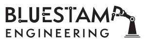

# Ball Tracking Robot

<!---
Replace this text with a brief description (2-3 sentences) of your project. This description should draw the reader in and make them interested in what you've built. You can include what the biggest challenges, takeaways, and triumphs from completing the project were. As you complete your portfolio, remember your audience is less familiar than you are with all that your project entails!


| **Engineer** | **School** | **Area of Interest** | **Grade** |
|:--:|:--:|:--:|:--:|
| Winston Z | The Quarry Lane School | Computer Science | Incoming Sophomore

<!---
**Replace the BlueStamp logo below with an image of yourself and your completed project. Follow the guide [here](https://tomcam.github.io/least-github-pages/adding-images-github-pages-site.html) if you need help.**


  
# Final Milestone

**Don't forget to replace the text below with the embedding for your milestone video. Go to Youtube, click Share -> Embed, and copy and paste the code to replace what's below.**

<iframe width="560" height="315" src="https://www.youtube.com/embed/F7M7imOVGug" title="YouTube video player" frameborder="0" allow="accelerometer; autoplay; clipboard-write; encrypted-media; gyroscope; picture-in-picture; web-share" allowfullscreen></iframe>

For your final milestone, explain the outcome of your project. Key details to include are:
- What you've accomplished since your previous milestone
- What your biggest challenges and triumphs were at BSE
- A summary of key topics you learned about
- What you hope to learn in the future after everything you've learned at BSE

-->

# Second Milestone

**Don't forget to replace the text below with the embedding for your milestone video. Go to Youtube, click Share -> Embed, and copy and paste the code to replace what's below.**

<iframe width="560" height="315" src="https://www.youtube.com/embed/y3VAmNlER5Y" title="YouTube video player" frameborder="0" allow="accelerometer; autoplay; clipboard-write; encrypted-media; gyroscope; picture-in-picture; web-share" allowfullscreen></iframe>

For my first milestone, I got the robot to move forward, move backwards, move left, move right, and stop. For my second milestone, I have gotten my robot to somewhat track the ball. However, it still needs some work, as it can only move left or right slightyly while tracking the ball. The camera is also working and it is able to track the ball.

Components I have added
  - Camera: It tracks the ball. Once the ball is on the camera, it creates a rectangle around the ball so it is easier to follow, and the code revolves around this.
  - Ultrasonic sensors: I haven't gotten it to work, but I have attached them. They tell the distance that the object is from the sensor. The sensor releases an ultrasonic wave that bounces off the object and back, and it can calculate the distance by the amount of time it takes to come back. My ultrasonic sensors tell the distance right now, but they are not very accurate.
  - Breadboard: The breadboard is a good way to create my circuits on, and it helped me link my ultrasonic sensors to the Raspberry Pi computer using resistors and wires. Breadboards are a great way to create circuits and test them withouth having to solder.

So far, I have started on the ball tracking part and finished with my camera code and movement code. A challenge I faced was getting the camera working. I didn't install it correctly and was not careful with it, so I messed up the pins and ruined the connection between the camera and the Raspberry Pi. Because of this, I had to get a new camera and install everything all over again. Also, the wires for my ultrasonic sensors were not long enough to reach thre front of the car so I had to redo the wires a couple times. My next step is to get the robot fully functioning and tracking the ball, while also adding my modifications. I will add an LED that shines green if the ball is less than a certain distance away, and red if they are further.

# First Milestone

**Don't forget to replace the text below with the embedding for your milestone video. Go to Youtube, click Share -> Embed, and copy and paste the code to replace what's below.**

<iframe width="560" height="315" src="https://www.youtube.com/embed/TY900STlwPE" title="YouTube video player" frameborder="0" allow="accelerometer; autoplay; clipboard-write; encrypted-media; gyroscope; picture-in-picture; web-share" allowfullscreen></iframe>

My project is a ball tracking robot. What it does is pretty straightfoward, it tracks a ball and follows it. It consists of a Raspberry Pi Computer, wheels, a L298N motor driver, DC motors, and two battery packs.

Components
  - Raspberry Pi Computer: This is the brain of the robot/car. It processes code and tells the car what to do. It has a 40 pin pinout, heat sinks, a USBC input, 2 mini HDMIs, 4 USB inputs, and an HDMI input
  - Battery Pack 1: Powers the Raspberry Pi computer
  - Battery Pack 2: Powers the L298N motor driver
  - Motor Driver: It powers the motors. The L298N can control the speed and direction of the motors through the code written in the Raspberry Pi computer. It is connected to the motors and to the Raspberry Pi Computer
  - DC Motors: DC motors run from converting electrical energy to mechanical energy, which makes it run


So far, I have almost completed the physical part of the project and got started on the coding part. For the physical part, I attached everything except the ultrasonic sensors. For the coding part, I have made 5 functions. Stop, move foward, move backwards, move left, and move right. I struggled with booting up the Raspberry Pi computer at first, but after a couple days I started to understand the project better. The wires kept on falling out of the motor driver too, and that was because I did not screw the screw in all the way. My SD Card also got corrupted while I was writing my code, so I had to restart on the coding part. My next step/milestone is to attach the ultrasonic sensors and get them working, and also test out the camera and get started on the code.


  
# Starter Project

<iframe width="560" height="315" src="https://www.youtube.com/embed/MqAtcLB15M0" title="YouTube video player" frameborder="0" allow="accelerometer; autoplay; clipboard-write; encrypted-media; gyroscope; picture-in-picture; web-share" allowfullscreen></iframe>

## Summary
My starter project is a RGB LED light. It displays a color depending on how you slide each of the 3 switches. Each switch controls the one of the RGB values. The further you slide each switch, the higher the value for that specific color gets. For example, if you slide the red switch all the way and none of the other swithces at all, the light will be red because the color is [255,0,0].

 (1).jpg)

Components
  - RBG LED: The LED displays the light depending on the RBG values
  - Switches: The switches are not on and off switches, they can be slid
  - Red switch: This switch determines the value of the color red from 0-255
  - Green switch: This switch determines the value of the color green from 0-255
  - Blue switch: This switch determines the value of the color blue from 0-255

As you slide the switches, the light changes colors. The light is depedent on the switches. The further you slide the switch, the brighter and stronger that sepcific color gets. You can also mix colors, but the mixed color will look more like the switch that is slid the furthest.

Challenges
  - Had trouble soldering the swithces onto the board
  - The light and the switches were not balanced and kept falling out at first

Next Steps

My next step is to start my intensive project. I will need to figure out where to mark my first and second milestones, and start familiarizing myself with tools around the workshop.

# Schematics 
Here's where you'll put images of your schematics. [Tinkercad](https://www.tinkercad.com/blog/official-guide-to-tinkercad-circuits) and [Fritzing](https://fritzing.org/learning/) are both great resoruces to create professional schematic diagrams, though BSE recommends Tinkercad becuase it can be done easily and for free in the browser. 

# Code
Here's where you'll put your code. The syntax below places it into a block of code. Follow the guide [here]([url](https://www.markdownguide.org/extended-syntax/)) to learn how to customize it to your project needs. 

```c++
void setup() {
  // put your setup code here, to run once:
  Serial.begin(9600);
  Serial.println("Hello World!");
}

void loop() {
  // put your main code here, to run repeatedly:

}
```

# Bill of Materials
Here's where you'll list the parts in your project. To add more rows, just copy and paste the example rows below.
Don't forget to place the link of where to buy each component inside the quotation marks in the corresponding row after href =. Follow the guide [here]([url](https://www.markdownguide.org/extended-syntax/)) to learn how to customize this to your project needs. 

| **Part** | **Note** | **Price** | **Link** |
|:--:|:--:|:--:|:--:|
| Item Name | What the item is used for | $Price | <a href="https://www.amazon.com/Arduino-A000066-ARDUINO-UNO-R3/dp/B008GRTSV6/"> Link </a> |
| Item Name | What the item is used for | $Price | <a href="https://www.amazon.com/Arduino-A000066-ARDUINO-UNO-R3/dp/B008GRTSV6/"> Link </a> |
| Item Name | What the item is used for | $Price | <a href="https://www.amazon.com/Arduino-A000066-ARDUINO-UNO-R3/dp/B008GRTSV6/"> Link </a> |

# Other Resources/Examples
One of the best parts about Github is that you can view how other people set up their own work. Here are some past BSE portfolios that are awesome examples. You can view how they set up their portfolio, and you can view their index.md files to understand how they implemented different portfolio components.
- [Example 1](https://trashytuber.github.io/YimingJiaBlueStamp/)
- [Example 2](https://sviatil0.github.io/Sviatoslav_BSE/)
- [Example 3](https://arneshkumar.github.io/arneshbluestamp/)

To watch the BSE tutorial on how to create a portfolio, click here.
